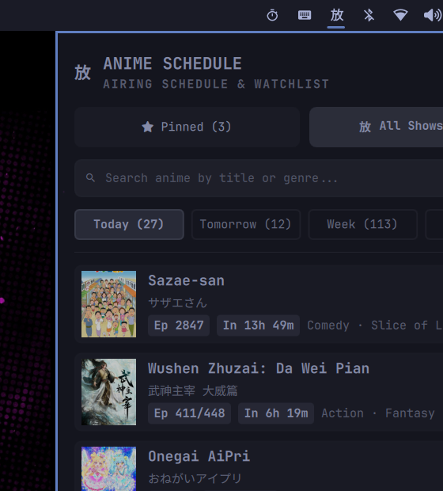

# 放 Omo Anitrack (`omo-anitrack`)

A sleek, native status bar widget and popover schedule tracker for **currently airing anime**, live release countdowns, and personal watchlists on **Omarchy Quattro**.

Powered by the free, public **AniList GraphQL API**.

<p align="center">
  
</p>

---

## ✨ Features

- **放 Native Omarchy Aesthetic**: Minimalist, monochromatic design matching Omarchy's typography with zero colored emoji clutter.
- **Live Release Countdowns**: Accurate countdowns (`In 2h 40m`, `In 13h 52m`, `Aired 1h ago`) calculated locally.
- **🔍 Instant Live Search**: Search anime in real-time across Romaji, English, Japanese native titles, and genres.
- ** Pinned Watchlist**: 1-click star your favorite seasonal shows to track only what you watch in the **Pinned** tab.
- **Multi-Day Schedule Breakdown**: Dynamic filter tabs for **Today**, **Tomorrow**, **Week**, and **All** with show counters.
- **Rich Anime Cards**: HD cover thumbnails, Romaji and Japanese native titles, episode pills (`Ep 10 / 12`), and genre tags.
- **1-Click Links**: Click any anime card to open its official AniList page in your default browser.
- **Gentle Status Feedback**: Sweeping progress bar indicator during updates and desktop notifications on fetch completion.
- **Zero Configuration**: Works 100% out of the box with zero API keys or accounts required.

---

## 📦 Prerequisites

Requires `curl` and `jq` (pre-installed on Omarchy/Arch Linux):

```bash
sudo pacman -S --needed curl jq
```

---

## 🚀 Installation & Management

### Installation

Install directly via the Omarchy CLI:

```bash
omarchy plugin add https://github.com/Praveensenpai/omo-anitrack --enable
```

### Update

To update to the latest release:

```bash
omarchy plugin update
```

### Removal

To disable or remove the plugin:

```bash
# Disable without deleting:
omarchy plugin disable paisen.omo-anitrack

# Remove completely:
omarchy plugin remove paisen.omo-anitrack
```

---

## ⌨️ Interactions & Shortcuts

| Action | Shortcut / Gesture |
|---|---|
| **Open Schedule Panel** | Left-Click on Bar Icon (`放`) |
| **Instant Force Refresh** | Right-Click / Middle-Click on Bar Icon or Click Refresh Button |
| **Star / Pin Anime** | Click `` on any Anime Card |
| **Open on AniList** | Left-Click on the Anime Card |

---

## 📄 License

MIT © [Praveensenpai](https://github.com/Praveensenpai)
